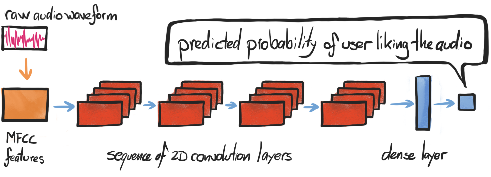
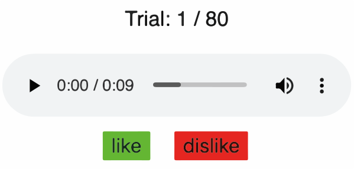
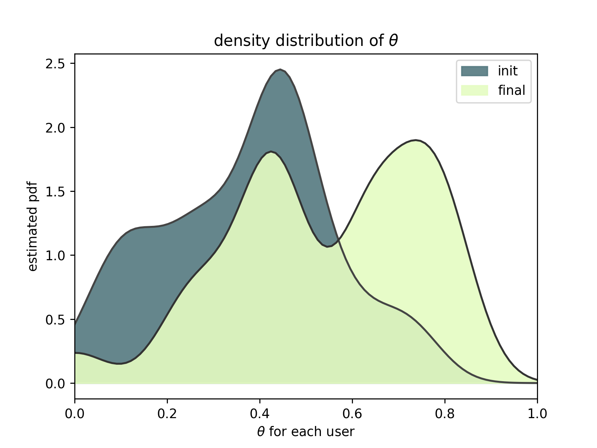
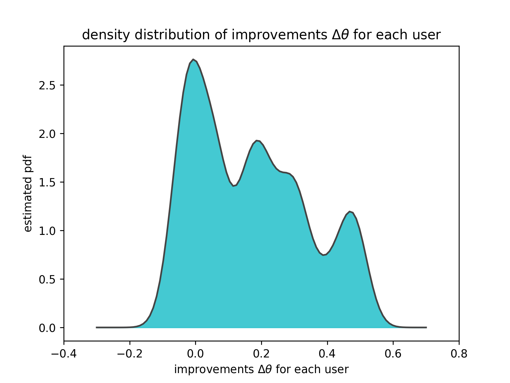

# DeepDrummer

DeepDrummer is a drum loop generation tool that uses active learning to learn the preferences (or current artistic intentions) of a human user from a small number of interactions. The principal goal of this tool is to enable an efficient exploration of new musical ideas. We train a deep neural network classifier on audio data and show how it can be used as the core component of a system that generates drum loops based on few prior beliefs as to how these loops should be structured.

DeepDrummer is composed of three main components:
- the web interface (presenting the user with drum loops to be rated as either *like* or *dislike*)
- the critic (learning what the user likes, serving as filter for future generated loops)
- the generator (propose new drum loops to achieve a good score with critic)

The critic network takes a drum loop's raw audio preprocessed as MFCC features, and then applies successive layers of convolutions in order to finally output its prediction about the probability that the user will *like* the drum loop.

<div style="width:400px;margin-left:50px;">


</div>

The generator is a function that outputs random grid sequencer patterns with 16 time steps during which 4 randomly-selected drum sounds can be triggered.

<div style="width:400px;margin-left:50px;">


</div>

We choose a very basic generator that does not have any trainable parameters, and constitutes a source of patterns that has few priors on musical structure. We selected drum sounds from a wide variety of one-shot samples without categorizing them into predefined roles as *kick*, *snare*, *hi-hat*, and so on.

Combined together, the feedback from the critic can serve as a powerful filter for the output of the generator. DeepDrummer can perform hill climing on drum patterns in order to please the critic (which serves as proxy for the user). As a result, the interface will present only the most relevant drum loops to the user for rating.

<div style="width:150px;margin-left:50px;">


</div>

We show a demonstration of all the pieces working together in the following YouTube video.

<div align="center">
  <a href="https://www.youtube.com/watch?v=EPKsUf5YBeM">
    
  </a>
</div>

The novelty of the method comes from the fact that all the learning capacity of the pipeline goes into the critic neural network instead of the generator. Because the critic network takes audio as input, we can also kickstart it
with existing library of music that the generator would not even be able to produce. A critic network trained on a higher-level representation (e.g. music notes) would not have access to such a wide catalog of popular music.

Note that in our practical experiment we preprocessed the input audio as MFCC features, but this is simply a decision from hyperparameter search and not a fundamental design choice.

One of the advantages of DeepDrummer working directly with audio is that it can also generalize across drum sounds. DeepDrummer does not have any notion of what a *kick* is, but it can learn that the user likes a certain kind of audio signal, and it can draw from a large collection of one-shot samples to find candidates that sound similar.

# Experiment

We run an experiment with 25 participants to demonstrate that 
meaningful gains are made with only 80 interactions (binary *like* or *dislike*).
To investigate this, we need to track some quantities that would reflect the improvement.
For each user we are interested in the proportion of drum loops that are *liked* at the beginning
(no training) versus at the end (after 80 ratings plus training).
We call these quantities `init_theta[i]` and `final_theta[i]` for user i,
which can each be interpreted as the MLE of the parameter for a Bernouilli distribution.
We also look at `delta_theta[i] = final_theta[i] - init_theta[i]`,
which corresponds to the actual improvement for that user.

In the following plot we compare the distributions of `init_theta` and `final_theta`,
using smoothing kernel to represent the pdfs (i.e. these are simply smoothed histograms).
We can visually see that there was a general measurable improvement of the quality
of the drum loops over the course of interacting with the user.
Values of theta closer to 1.0 are more desirable.

<div style="width:450px;margin-left:50px;">


</div>

In the next plot we look at the differences `delta_theta[i]`
to see the individual improvement for each user.
Positive values are desirable.

<div style="width:450px;margin-left:50px;">


</div>

We see a clear improvement over the course of training
based on the fact that most of the values in the above diagram are
larger than zero.
Even better news is that we have measured 36% of our participants having an improvement of 0.2 or more.
We find this to be a convincing argument that DeepDrummer is learning
something meaningful from very few interactions with the users
despite using very weak priors on musicality.

## Failure cases

It's worth acknowledging that, for about 28% of users, no improvement was observed.
To explain the failure cases,
we turn to our own personal experience with DeepDrummer.
We have observed that there are certain times
where it fails to obtain good early recommendations that
would orient it in a promising direction. This means that the
learning process would take longer, and no significant progress
would be seen during the brief duration of the experiment.
The opposite can also happen if DeepDrummer accidentally lands
on a vein of good drum loops and spends most of its time
exploring neighbors of those intial drum loops.
Another potential pitfall that we have observed
in the early experiments during the development of DeepDrummer
is that we found challenging initially to make up our minds and
be consistent with what we *liked*.
We ourselves got better at this task,
but for all our participants it was the first time
that they interacted with DeepDrummer.

## About shifting user preferences

We were very concerned about the possibility that the expressed preferences
of users would evolve during the experiment,
and that we would mainly capture this shift instead of
measuring accurately the improvement of DeepDrummer.

We found a way to set up our experimental protocol to
avoid this phenomenon entirely.
We split our experiment into an interactive Phase I where learning takes place,
and an evaluation Phase II during which we present the user with drum loops
for either the initial or final model at random.
In Phase II, the user does not know from which model
the drum loops are coming from, so they cannot purposefully or
subconsciously try to influence the results.
The fact that the drum loops from the two models
are presented in an intervowen way nullifies the
effects the shifting preferences.
More on this can be found in our paper.

# Fun samples

We provide many samples in the dataset that we released, but here are a few
of the samples that we encountered and that we liked.

[TODO : As much as I can put html for the div elements, it seems that I can't do the same thing with .wav files. Find out the best to showcase them.]

```
<audio controls>
  <source src="drum_loops_selection/like_tmp8s0e3v61.wav" type="audio/ogg">
Your browser does not support the audio element.
</audio>
<audio controls>
  <source src="drum_loops_selection/like_tmp0p4uf8w2.wav" type="audio/ogg">
Your browser does not support the audio element.
</audio>
<audio controls>
  <source src="drum_loops_selection/like_tmp429b3xfg" type="audio/ogg">
Your browser does not support the audio element.
</audio>
<audio controls>
  <source src="drum_loops_selection/like_tmpvq4q_u9n.wav" type="audio/ogg">
Your browser does not support the audio element.
</audio>
```

For fun, we also tried to use all the ratings from all the 25 participants
in order to have DeepDrummer synthesize candidates for the most universally-appreciated drum loops.

[TODO : Put them here.]

# Dataset released

[TODO : Briefly describe the dataset that we're publishing, and give the download link. Make it sound like it's a contribution in its own right, but don't sell it too hard because we don't want to eclipse the actual core DeepDrummer.]

# Running the code

The interactive experiment that we ran with DeepDrummer can be reproduced
by running everything in a Docker container and connecting to it through
a web browser (preferably Chrome).

```bash
git clone git@github.com:mila-iqia/DeepDrummer.git .
cd DeepDrummer
docker build -f Dockerfile.deepdrummer -t deepdrummer .
# by default we are exposing the port 5000 for the http server
docker run -it -p 5000:5000 deepdrummer bash /var/local/src/DeepDrummer/start_web_server.sh
```
Then you connect to http://127.0.0.1:5000 with a web browser.

Naturally, DeepDrummer works fine outside of a Docker container.
You can refer to `Dockerfile.deepdrummer` to have a better idea of what
the requirements are.

[TODO : Once it works, try it out on OSX so we can actually say that we made it work on OSX.]

## GPU or CPU

It is better to run the Docker container on a machine with an Nvidia GPU,
but the computational load is rather light so it does not require a powerful GPU.
It runs also fine on CPU only, but this can add delays and unresponsiveness
in the interaction through the web browser.
In practice, we found that [TODO : essayer l'expérience pour voir et pour
pouvoir dire à quel point c'est raisonnable ou pas du tout].

As documented on https://github.com/NVIDIA/nvidia-docker, it is possible
to configure Docker to use GPUs. After some updates to Docker, this
can be done with just a flag. You can test your setup with the following command:
```bash
docker run --gpus all nvidia/cuda:10.0-base nvidia-smi
```
Similarly, you can run DeepDrummer with a GPU by using
```bash
docker run -it -p 5000:5000 deepdrummer bash /var/local/src/DeepDrummer/start_web_server.sh
```

[TODO : Once the web server works in Docker, I can test drive this thing and make sure that the commands and flags are correct.]

## Starting from pre-trained model

[TODO : Remove this section once we're sure we don't want to do it.]

# Links

[TODO : We can do this section once we have the green light to publish the paper on arXiv and the advertise the YouTube link.]

Reminder about links for arXiv, github, youtube and dataset, even though the links were given in the previous sections.

Bibtex to cite us.

